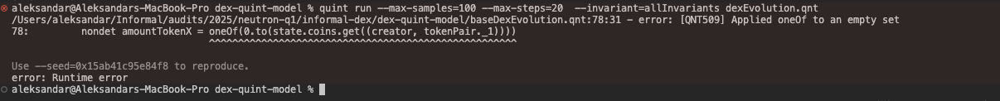
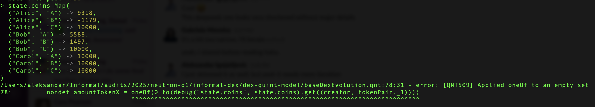

# Quint model impressions and tips

## Impressions

### Postconditions

Postconditions are not changed to reflect changes introduced with SwapOnDeposit. Postconditions are a part of `all` operator [here](dexEvolution.qnt#L47-L49).

Solution: For now I have commented it out in order to get to remove obstacle.

### Failing invariant

After commenting out the `postconditions`, invariant `nonNegativeBalances` was failing. That happened because balance was going negative. In order to get the trace to see what was going wrong, I can use tag `--out-itf` in the combination with trace name, e.g. `--out-itf=negativeBalances.itf.json`. Seeing the trace produced another [problem](#autoswap-is-not-active-at-the-same-time-as-swapondeposit).

Coming back to the negative balances, this got us thinking that maybe something was wrong with the tick. So I have inspected the implementation of `SwapOnDeposit`. The following code snippet shows how it was implemented before:

```scala
        val depositTickToken0 = -tickIndex + fee
        
        // TODO: this is unnecarily computationally intensive. But it does allow us to ensure that both sides can 
        // never be behind enemy lines. 
        val swapResult0To1 =  swap(
                (tokenPair._1, tokenPair._2),
                tranches,
                pools,
                amount0,
                -depositTickToken0,
                0
            )
        val swapResult1To0 =  swap(
                (tokenPair._2, tokenPair._1),
                tranches,
                pools,
                amount1,
                depositTickToken0,
                0
        )
```

Proposed solution:

```scala
        val depositTickToken0 = -tickIndex + fee
        val depositTickToken1 = tickIndex + fee
        
        // TODO: this is unnecarily computationally intensive. But it does allow us to ensure that both sides can 
        // never be behind enemy lines. 
        val swapResult0To1 =  swap(
                (tokenPair._1, tokenPair._2),
                tranches,
                pools,
                amount0,
                depositTickToken0,
                0
            )
        val swapResult1To0 =  swap(
                (tokenPair._2, tokenPair._1),
                tranches,
                pools,
                amount1,
                depositTickToken1,
                0
        )
```

However this did not solve the issue.

### Autoswap is not active at the same time as swapOnDeposit

From the last step in the [trace](resources/negativeBalance.itf.json) can be seen that `autoswap` is turned OFF, while `swapOnDeposit` is turned ON. Since this is disabled by design in the message validation, this should not be allowed to happen in Quint model.
Current state:

```scala
        nondet doAutoswap = oneOf(Set(true, false))
        nondet doSwapOnDeposit = oneOf(Set(true, false))
```

Proposed fix:

```scala
        nondet doAutoswap = oneOf(Set(true, false))
        val doSwapOnDeposit = if(doAutoswap) oneOf(Set(true, false)) else false
```

### `swap` function returns values which are not used to update states later

Probably the SwapOnDeposit should also return values which were changed during swap function. For example, swap function returns:

```scala
type SwapUpdateInfo = {
        remainingAmount: int,
        outAmount: int,
        tranchesUpdates: TrancheKey -> TrancheUpdateDiff,
        poolUpdates: PoolId -> PoolUpdateDiff,
        orderFilled: bool,
    }
```

This indicates that `tranches` and `pools` will be updated, however there are no updates of those states in `swapOnDeposit` function. This means that if `swapOnDeposit` is to work, model has also to update mentioned states, so it has to get information about it from swapOnDeposit function. States are updated in the action `depositAction` which calls `deposit` which then callse `swapOnDeposit`, meaning that in order for `swapOnDeposit` to work, that information about changed `tranches` and `pools` needs to be propagated to the `depositAction`.


## Tips

### Seeing formatted trace

Install ITF trace viewer to see the trace.

### Restarting a particular simulation

If simulation resulted in certain problems, or for any reason you would like to restart the simulation, here is how:
Every execution returns `seed` and in order to reporoduce it, to the command you ran in the terminal, attach `--seed=<seed_number_received>`.

### Debugs

Using debugs wherever possible. For example, after commenting out `nonNegativeBalances` invariant, I got the following:



In order to figure out what the problem was, using debugs was useful. Debugs are regarded as an expression, so the following code snippet shows how to print what is the state of the coins:

```scala
        nondet amountTokenX = oneOf(0.to(debug("state.coins", state.coins).get((creator, tokenPair._1))))
```

For print to be shown, in [consts.qnt](consts.qnt#L7-L7) there is a value `DEBUG_ENABLED` which indicates wether to show prints or not.

After print is added, and the simulation is restarted, here is the output:



This is a problem because `0.to(state.coins.get((creator, tokenPair._1)))` returns an emtpy array which then causes error when trying to nondeterministicly pick from it.
